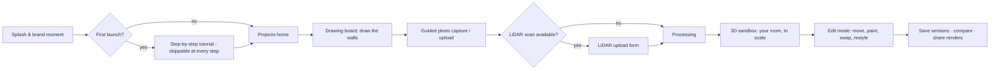
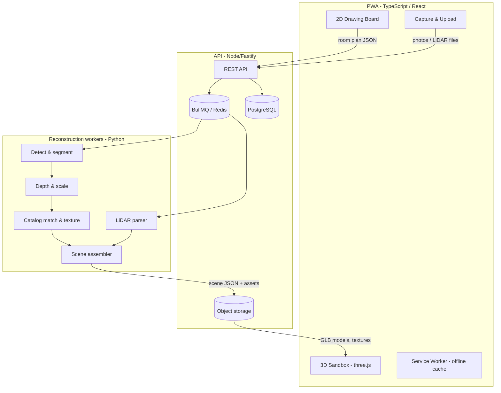

# My Room Sandbox — Master Blueprint

**Version 1.0 · July 2026 · Status: Ready for build**

This is the master blueprint for **My Room Sandbox**, a progressive web app (PWA) that turns a hand-drawn wall outline plus a handful of photos — and, optionally, a LiDAR scan — into a perfectly scaled, fully **editable** 3D sandbox of a real room. Users can then redesign that room freely: move the couch, repaint the walls, rehang the art, swap the rug, and see it all visualized beautifully.

This document is the entry point. It defines the vision, the one non-negotiable architectural principle, the technology decisions, and the reading order for the detailed specification documents in [`docs/`](docs/). A development team should be able to build the entire product from this document set without further product guidance.

---

## 1. The product in one paragraph

A husband and wife want to redo their living room, but they can't agree on — or picture — how. They open My Room Sandbox, sketch the four walls of the room with their finger, snap six photos following the guided capture flow (or upload the LiDAR scan one of their iPhones already took), and tap **Build my room**. A minute later they are looking at their living room in 3D: right size, right layout, their couch, their TV console, their gallery wall. They tap **Edit** and start playing: the couch slides to the far wall, the walls turn sage green, the framed prints move above the sideboard. Every idea gets visualized in seconds, at true scale, before anyone lifts a real piece of furniture.

## 2. The one principle everything hangs on

> **The room is rebuilt from discrete objects, never delivered as a fused scan.**

Photogrammetry and raw LiDAR meshing produce a single welded mesh — the couch is fused into the floor, the picture frames are baked into the wall. That output is *viewable* but not *editable*, and editing is the entire point of this product.

My Room Sandbox therefore performs **semantic reconstruction**:

1. **Understand the space.** The user-drawn wall plan (refined by LiDAR when available) defines an accurate, watertight room shell.
2. **Understand the contents.** Computer vision detects, segments, classifies, and measures each object in the user's photos.
3. **Rebuild, don't copy.** Each detected object is instantiated as an independent 3D model — matched from a curated CC0 furniture catalog and re-colored/re-textured from the photos — placed at its measured position in the shell.

The result is a scene graph of clean, movable, swappable objects inside an accurate room shell. This principle drives the data model, the pipeline, the editor, and the roadmap. Every implementation decision should be tested against it.

## 3. Locked technical decisions

These decisions are made. Do not reopen them without a strong, documented reason.

| Decision | Choice | Why |
|---|---|---|
| Language | **TypeScript** end-to-end (Python only for vision workers) | One language across app + API; strict typing for a geometry-heavy codebase |
| App shell | **React 18 + Vite + Workbox PWA** | Installable on iOS/Android/desktop from one codebase; fast dev loop |
| 3D engine | **Three.js via react-three-fiber (+ drei)** | Mature, MIT-licensed, huge ecosystem, declarative scene graph that matches React state |
| 2D drawing board | **Custom SVG/canvas editor** (conventions from `react-planner` / Blueprint3D, both MIT) | Full control over the CAD feel; proven open-source references |
| State | **Zustand** + command-pattern undo/redo | Simple, fast, serializable — the whole project is one JSON document |
| Backend | **Node 20 + Fastify** API, **BullMQ + Redis** job queue, **PostgreSQL** metadata, **S3-compatible** object storage | Boring, scalable, cheap; reconstruction is async job work by nature |
| Vision workers | **Python 3.11**: Grounding DINO + SAM 2 (detect/segment), Depth Anything V2 (metric depth), Open3D (point clouds) | All Apache-2.0/MIT — commercially safe; state of the art as of 2026 |
| LiDAR input | **Apple RoomPlan USDZ + JSON** (first-class), PLY / GLB / E57 / LAS point clouds (supported) | RoomPlan is already parametric (walls/doors/objects as data) — the highest-value input we can receive |
| Graphics style | **"Warm realistic-lite"** — PBR materials, soft IBL lighting, gentle AO, no uncanny photorealism | Premium and beautiful on mid-range phones; flattering to catalog-matched furniture |
| Assets | **CC0 only** for bundled content: Poly Haven (textures/HDRIs/models), ambientCG (materials), Quaternius & Kenney (furniture fill-ins) | Zero licensing risk, redistribution-safe |
| Units | **Meters internally, always.** Display toggle for imperial | Single source of truth for all geometry math |

Full library-by-library licensing table: [`docs/08-open-source-stack.md`](docs/08-open-source-stack.md).

## 4. The user journey (summary)

Each step is specified screen-by-screen in [`docs/01-product-and-flows.md`](docs/01-product-and-flows.md).

## 5. System shape (summary)

Details, contracts, and offline strategy: [`docs/03-architecture.md`](docs/03-architecture.md).

## 6. Reading order for the build team

| # | Document | What it specifies | Read it before building… |
|---|---|---|---|
| 1 | [`docs/01-product-and-flows.md`](docs/01-product-and-flows.md) | Every screen, every state, the full UX | anything |
| 2 | [`docs/02-design-system.md`](docs/02-design-system.md) | Visual language, typography, motion, components | any UI |
| 3 | [`docs/03-architecture.md`](docs/03-architecture.md) | System design, API surface, offline, jobs | any code |
| 4 | [`docs/04-drawing-board-spec.md`](docs/04-drawing-board-spec.md) | The 2D wall editor and its CAD conventions | Milestone 1 |
| 5 | [`docs/05-reconstruction-pipeline.md`](docs/05-reconstruction-pipeline.md) | Photos/LiDAR → editable objects, stage by stage | Milestones 4–5 |
| 6 | [`docs/06-sandbox-and-editing.md`](docs/06-sandbox-and-editing.md) | The 3D scene, editing tools, rendering | Milestones 2–3, 6 |
| 7 | [`docs/07-data-model.md`](docs/07-data-model.md) | JSON schemas for every entity; accepted file formats | any code |
| 8 | [`docs/08-open-source-stack.md`](docs/08-open-source-stack.md) | Every dependency and asset source, with license | dependency setup |
| 9 | [`docs/09-roadmap.md`](docs/09-roadmap.md) | Six milestones with acceptance criteria | sprint planning |

## 7. Build order (summary)

The roadmap ([`docs/09-roadmap.md`](docs/09-roadmap.md)) sequences the work so that **every milestone ships a usable product**:

1. **M1 — Draw.** PWA shell + tutorial + drawing board. Users can draw and save accurate floor plans.
2. **M2 — Extrude.** Walls become a navigable 3D room shell. The "wow, that's my room's shape" moment.
3. **M3 — Furnish.** Full edit mode with the CC0 catalog — manual placement, painting, materials. The product is already a useful room planner here.
4. **M4 — Reconstruct.** The photo pipeline populates the room automatically. The headline feature lands on a foundation that already works.
5. **M5 — LiDAR.** RoomPlan/point-cloud ingestion upgrades accuracy.
6. **M6 — Polish.** Rendering quality, comparisons, sharing, performance, premium finish.

## 8. What this product is not (scope guards)

- **Not a scanner app.** We never ask users to walk around capturing hundreds of frames; we accept a wall sketch + a few photos, or files exported from tools they already have.
- **Not an exact-replica renderer.** Objects are *recognized and recreated*, not cloned pixel-for-pixel. A matched couch at the right size, position, and color is the promise; a photogrammetric twin is not.
- **Not a marketplace (v1).** No shopping links, no vendor catalogs in v1. The data model reserves room for this later (`PlacedObject.commerce` is an intentional extension point).
- **Not multiplayer (v1).** Single-user projects with shareable read-only renders. Real-time collaboration is a v2 candidate.

---

*All documents in this set are written to be handed to a development team as-is. Where a judgment call was possible, the call has been made and recorded — build what is written.*
