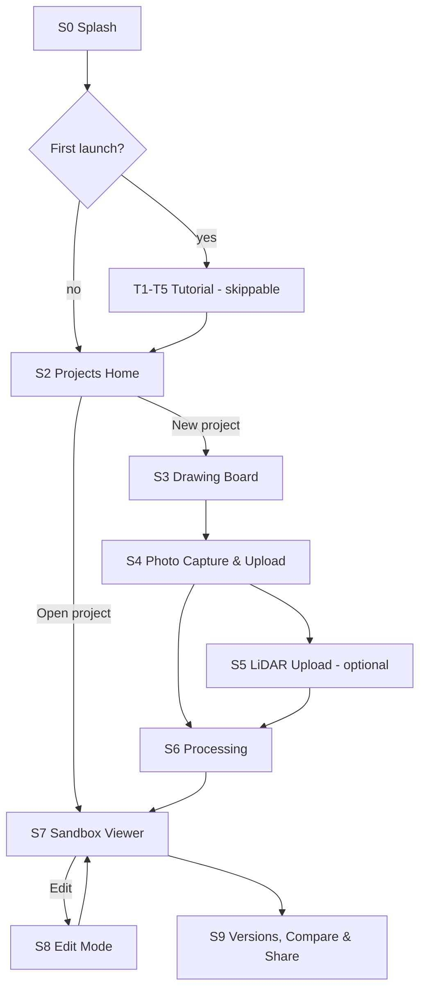

# 01 · Product & User Flows

Screen-by-screen specification of the entire user experience. The running example throughout is the scenario the product was designed for: **a couple redoing their living room** — they know the room, they disagree about the future, and they need to *see* options at true scale before committing.

Design language, tokens, and components used below are defined in [`02-design-system.md`](02-design-system.md).

---

## 1. Flow map

Every arrow is a user action; there are no dead ends. Back navigation is always available and never loses work (state is persisted continuously — see [`03-architecture.md`](03-architecture.md) §6).

---

## 2. S0 — Splash & brand moment

The first two seconds must feel like a premium iOS app, not a website.

- Full-bleed background: a slow, subtle 3D dolly through a beautifully lit sample room (pre-rendered 4-second video loop, ~1 MB, cached by the service worker; static image fallback until cached).
- **App name treatment:** "My Room Sandbox" set large (Display/XL token — 44 pt equivalent), SF-style variable font, animated in with a 400 ms fade-and-rise. This is the "big beautiful app name" moment; it also appears on the Projects Home masthead.
- Wordmark sub-line: *"Your room. Reimagined."*
- Auto-advances after 1.8 s or on tap. Never shows a spinner; if the app isn't ready, the splash simply holds.

**Acceptance criteria**
- Cold start to interactive Home in < 3 s on a mid-range phone (Moto G-class) over 4G; < 1.5 s warm.
- Splash respects `prefers-reduced-motion` (crossfade only, no dolly).

## 3. T1–T5 — Tutorial (fully skippable)

A five-step guided tour shown on first launch only. **"Skip" is always visible, top-right, on every step**, and a page-dot control allows jumping. Completing *or* skipping sets `tutorialSeen=true`; it never auto-plays again but remains available from Settings → "Replay tutorial."

| Step | Title | Content (each: one looping 6–10 s demo animation + one sentence) |
|---|---|---|
| T1 | Draw your walls | Finger draws a rectangle, dimensions appear live |
| T2 | Snap your room | Phone photographs a wall section; overlay shows the guided-capture frame |
| T3 | Got LiDAR? Even better | A scan file drops onto the upload form; accuracy badge upgrades |
| T4 | Watch it build | Processing screen morphs into the finished 3D room |
| T5 | Make it yours | Couch drags across the room; wall changes color |

**Acceptance criteria**
- Skipping at any step lands on Projects Home in one tap.
- Total asset weight for the tutorial < 3 MB, lazy-loaded after first paint.

## 4. S2 — Projects Home

- Masthead: app name (Display/L), then a project grid. Each project card shows a saved 3D thumbnail render, name, room dimensions, and last-edited time.
- Primary action: a large **"＋ New room"** button (floating, bottom-center, thumb-reachable).
- Empty state (first use): a single beautiful card — *"Start with your walls"* — that opens the Drawing Board.
- Long-press a card: rename, duplicate, delete (delete requires confirm).

## 5. S3 — Drawing Board (walls only)

The user draws **only the walls**. Everything else is derived or captured later. Full editor spec: [`04-drawing-board-spec.md`](04-drawing-board-spec.md). Product-level requirements:

- Blank board opens instantly with a friendly hint: *"Draw your first wall — don't worry about being perfect."*
- Tools (bottom toolbar): **Wall**, **Select**, **Door**, **Window**, **Measure**, **Undo/Redo**.
- Live dimension labels on every segment while drawing; tap any label to type an exact length ("12' 4"" or "3.76 m" both parse).
- Snapping: endpoints, 90°/45° ortho, and closure snap (when the pen nears the starting point, the room "clicks" closed with a haptic tick).
- The room must be a closed polygon before proceeding; the **"Next: add photos →"** button stays disabled with an explanatory tooltip until closure.
- Wall height is asked **once**, after closure, via a simple sheet (default 2.44 m / 8 ft, common presets + custom).

**Running example:** the couple sketches their 4.8 m × 6.2 m living room in ~40 seconds, taps the long wall's label to correct it to exactly 6.20 m, closes the loop, accepts 8 ft ceilings.

## 6. S4 — Guided photo capture & upload

Photos are how the app learns *what's in the room*. The capture flow maximizes reconstruction quality without feeling like work.

**Guided capture (camera):**
- The app walks the room wall-by-wall, driven by the drawn plan: *"Stand back and photograph Wall A — get the whole wall in frame."* An overlay shows which wall (highlighted on a mini-plan) and a level indicator encourages square-on framing.
- Requested set, generated from the plan: 1 photo per wall + 1 corner-to-corner wide shot per opposing corner pair + optional close-ups of "things you care about" (unlimited).
- Each capture gets an instant quality check (blur, exposure, coverage); failures prompt a friendly retake suggestion, never a block.

**Upload path:** users can instead (or additionally) pick existing photos from their library. Each uploaded photo must be tagged to a wall by tapping the mini-plan (one tap; the tag is a hint for the pipeline, not a hard constraint).

- Minimum to proceed: **1 photo per wall**. The Next button shows progress ("3 of 4 walls photographed").
- EXIF is read when present (focal length, orientation) and used by the scale solver ([`05-reconstruction-pipeline.md`](05-reconstruction-pipeline.md) §4).

## 7. S5 — LiDAR upload (optional form)

A single, clearly optional screen between photos and processing: *"Have a 3D scan? It makes your room noticeably more accurate."*

- **Accepted files:** RoomPlan export (`.usdz` + companion `.json`), `.ply`, `.glb`, `.e57`, `.las`/`.laz`. Max 500 MB. Drag-and-drop on desktop; file picker / share-sheet on mobile.
- Plain-language help section: "How do I get a scan?" — expandable cards for Apple RoomPlan-based apps and common scanner apps (Polycam, Scaniverse, 3d Scanner App) with export-format guidance per app.
- On file selection: client-side validation of extension + magic bytes, then upload with progress. A parsed preview (point-cloud silhouette over the drawn plan) confirms the scan matches the room before processing.
- **Accuracy badge:** the project header shows `Sketch` → `Photo-calibrated` → `LiDAR-verified` as inputs improve. This badge is the honest signal of expected precision (tiers defined in [`05-reconstruction-pipeline.md`](05-reconstruction-pipeline.md) §7).
- Skippable with one tap: **"Continue without a scan."**

## 8. S6 — Processing

Reconstruction takes 30–120 s server-side. This screen makes the wait *delightful and transparent*:

- The drawn floor plan is displayed and progressively "comes alive": walls extrude, then detected-object silhouettes pop in one by one as the pipeline reports them (live via SSE — see [`03-architecture.md`](03-architecture.md) §5), each labeled ("Found: sofa · 2.2 m").
- Stage list with checkmarks: Reading photos → Finding objects → Measuring → Matching furniture → Building your room.
- Fully backgroundable: user can leave; a push notification (if permitted) and a Home-card badge announce completion.
- Failure UX: partial results are always shown (see pipeline §8 fallbacks) with per-object "needs a better photo" prompts — never a dead-end error screen.

## 9. S7 — Sandbox Viewer

The payoff screen. The finished room fades in with a slow establishing orbit (1.5 s), then hands over control.

- **Navigation:** one-finger orbit, two-finger pan, pinch zoom — from full dollhouse view down to close inspection of a shelf. Double-tap an object to focus-frame it. A **2D/3D toggle** flips to top-down plan view.
- Persistent bottom bar: **Edit** (primary), **Versions**, **Share**, view options (dollhouse/walk-level camera presets, wall-fade toggle so near walls turn translucent instead of blocking the camera).
- Tapping any object shows its info card: matched name, measured size, confidence, "wrong item?" → opens the swap sheet.

**Running example:** the couple orbits their living room. The sofa, TV console, rug, floor lamp, coffee table, and six wall frames are all present, at true scale, in roughly true colors. It reads unmistakably as *their* room.

## 10. S8 — Edit Mode

The heart of the product. Full interaction spec: [`06-sandbox-and-editing.md`](06-sandbox-and-editing.md). Product-level requirements:

- **Move anything:** drag objects on the floor plane with live snapping (wall-parallel, against-wall, centered-on-wall) and collision hints. Wall-mounted items (frames, shelves, TVs) drag *along and between walls*, never floating off them.
- **Paint anything:** tap a wall → color sheet (curated palettes + full picker + "pick from my photos" eyedropper). Per-wall or all-walls. Same flow for floor material (wood/tile/carpet swatches from the CC0 material library).
- **Swap anything:** any object can be replaced from the catalog (similar-items-first ordering), resized within plausible bounds, recolored, duplicated, or deleted.
- **Add anything:** browsable catalog of CC0 furniture/decor, searchable, with size-aware "fits here" filtering.
- Undo/redo across every action, unlimited within a session, persisted per version.
- All edits are non-destructive: **"Original room"** is version zero, always restorable, never overwritable.

**Running example:** she drags the sofa to the window wall; it snaps flush and the rug auto-suggests recentering. He paints Wall B sage green. They duplicate the version, try a darker green on version 3, and flip between versions 2 and 3 to compare.

## 11. S9 — Versions, Compare & Share

- **Versions:** named snapshots ("Sage option," "Dark & moody"), each with a thumbnail; create, rename, duplicate, delete. Version zero is locked as "Original room."
- **Compare:** side-by-side or A/B slider between any two versions from the same camera angle.
- **Share:** export a high-quality render (2× resolution offline render pass) as an image, or a **read-only web link** that opens the interactive 3D scene for a recipient (no account required — link contains a scoped token; recipients cannot edit).

## 12. Cross-cutting product rules

1. **Never lose work.** Every state change persists locally (IndexedDB) immediately and syncs when online. Kill the app at any moment; reopen exactly where you were.
2. **Skippable everything.** Tutorial, LiDAR, guided capture coaching — every optional step has a one-tap skip that is visually obvious.
3. **Honest accuracy.** The Sketch/Photo-calibrated/LiDAR-verified badge is always visible on the project. We never imply millimeter precision we don't have.
4. **Editable everything.** If it renders, it can be selected; if it can be selected, it can be moved, restyled, swapped, or removed. No baked-in objects, ever (see the master principle in [`../BLUEPRINT.md`](../BLUEPRINT.md) §2).
5. **Offline-first viewing/editing.** Once a room is built, viewing and editing work fully offline; only reconstruction requires connectivity.
6. **Privacy by default.** Photos and scans are used only for the user's reconstruction, encrypted at rest, and deletable (project deletion purges all uploads and derived data within 24 h). State this in plain language on the capture screen.
