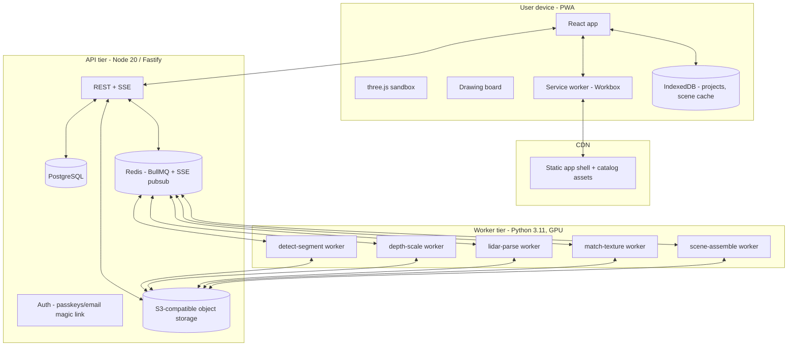

# 03 · System Architecture

TypeScript PWA client, Node API, Python vision workers. Everything geometry-related speaks one schema ([`07-data-model.md`](07-data-model.md)); everything heavy is an async job.

---

## 1. Topology



## 2. Client (PWA)

- **Stack:** React 18 + Vite + TypeScript strict. Routing: React Router (4 routes: home, editor `/p/:id/draw`, capture `/p/:id/capture`, sandbox `/p/:id`). State: Zustand stores (`projectStore`, `sceneStore`, `uiStore`) with the command-pattern undo stack.
- **3D:** three.js via `@react-three/fiber` + `@react-three/drei`. Scene state lives in Zustand; R3F components are pure renderers of the `Scene` document.
- **2D drawing board:** custom SVG renderer (see [`04-drawing-board-spec.md`](04-drawing-board-spec.md)) sharing the same geometry utilities package (`packages/geometry`) as the 3D extruder — one source of truth for wall math.
- **PWA:** Workbox-generated service worker.
  - *Precache:* app shell, fonts, core UI assets.
  - *Runtime cache:* catalog GLBs + textures (`CacheFirst`, LRU 512 MB), API GETs (`StaleWhileRevalidate`), scene bundles (`CacheFirst`).
  - *Installability:* manifest with maskable icons, standalone display, dark theme-color; iOS meta tags for status-bar style and home-screen icon.
- **Monorepo layout:**

```
apps/web            # the PWA
apps/api            # Fastify API
workers/vision      # Python pipeline workers
packages/schema     # zod schemas + generated JSON Schema (single source of truth)
packages/geometry   # wall/polygon/units math, shared client+server
packages/catalog    # catalog manifest + asset pipeline scripts
```

`packages/schema` is the contract: the API validates with it, the client types from it, and Python workers validate against the generated JSON Schema files. Never hand-write a type that exists in schema.

## 3. API surface (v1)

REST, JSON, versioned under `/v1`. Auth: passkeys primary, email magic-link fallback; JWT session cookies (httpOnly). All uploads go direct-to-storage via presigned URLs — the API never proxies file bytes.

| Method & path | Purpose |
|---|---|
| `POST /v1/projects` | Create project (body: name) |
| `GET /v1/projects` · `GET /v1/projects/:id` | List / fetch (fetch includes latest `Scene`) |
| `PATCH /v1/projects/:id` · `DELETE` | Rename / delete (delete purges storage, §7) |
| `PUT /v1/projects/:id/plan` | Save the drawn `RoomPlan` document |
| `POST /v1/projects/:id/uploads` | Get presigned URL (body: kind `photo|lidar`, filename, size, sha256) |
| `POST /v1/projects/:id/uploads/:uploadId/complete` | Confirm upload; server validates magic bytes + runs AV scan |
| `POST /v1/projects/:id/reconstruct` | Enqueue the pipeline; returns `jobId` |
| `GET /v1/jobs/:jobId/events` | **SSE** stream of pipeline progress (stage, per-object discoveries) |
| `GET /v1/projects/:id/scene` · `PUT` | Fetch / save the `Scene` document (edit-mode saves; ETag optimistic concurrency) |
| `POST /v1/projects/:id/versions` · `GET` · `DELETE` | Version snapshots |
| `POST /v1/projects/:id/share` | Mint read-only share token; `GET /v1/shared/:token` resolves it |
| `GET /v1/catalog?query=&category=&fits=WxDxH` | Catalog search (also fully cached client-side for offline) |

Rate limits: 10 reconstructions/project/day, 100 uploads/project. Errors follow RFC 9457 (`application/problem+json`).

## 4. Job pipeline

BullMQ queues over Redis, one queue per stage, chained by a `reconstruct` orchestrator job:

```
reconstruct(projectId)
 ├─ lidar-parse        (skipped if no scan)      → refined shell + object boxes
 ├─ detect-segment     (per photo, parallel)     → masks + classes
 ├─ depth-scale        (per photo, parallel)     → metric depth + camera pose vs plan
 ├─ match-texture      (per object)              → catalog match + albedo/color
 └─ scene-assemble     (fan-in)                  → Scene document + asset bundle → S3
```

- Workers are containerized Python (one GPU each for detect/depth; CPU for parse/assemble), consuming BullMQ jobs via `bullmq` Python client. Horizontal scale = add containers.
- Every stage writes progress events to Redis pub/sub → API relays over SSE → the Processing screen animates in real time.
- Stage timeout 5 min, 2 retries, then the orchestrator degrades gracefully (partial scene with placeholders — see [`05-reconstruction-pipeline.md`](05-reconstruction-pipeline.md) §8). Total job budget 10 min hard cap.
- Model weights baked into worker images; pipeline stage details and model choices live in doc 05.

## 5. Realtime & notifications

- **SSE** (not WebSockets) for job progress — one-directional, proxy-friendly, reconnects free via `Last-Event-ID`.
- **Web Push** (VAPID) for "your room is ready" when the app is backgrounded; permission requested only at first processing run, contextually.

## 6. Offline & sync model

- The **entire project document** (plan + scene + versions) lives in IndexedDB as the write-primary copy. Edits apply locally first, then sync via `PUT /scene` with ETag; conflicts (rare: single-user product) resolve last-write-wins with the losing copy stored as a recovery version.
- Reconstruction requires connectivity (GPU work); the UI queues the request offline via Workbox Background Sync and fires it on reconnect.
- Scene asset bundles (GLB + textures, typically 5–30 MB) are cached after first load → full offline viewing/editing thereafter.

## 7. Storage & privacy

- Buckets: `uploads/` (user photos + scans; private, per-user prefix), `scenes/` (derived bundles; private), `catalog/` (public, CDN-fronted, immutable + content-hashed).
- All private objects: SSE-S3 encryption at rest, presigned GETs with 15 min expiry.
- **Deletion is real:** project delete → immediate DB tombstone → storage purge job removes all `uploads/` and `scenes/` objects within 24 h; purge completion is audited.
- Photos/scans are never used for anything except the owning user's reconstruction. No training on user data. This is a product promise (doc 01 §12) — enforce it in policy and code review.

## 8. Observability & environments

- OpenTelemetry traces across API → queue → workers (one trace per reconstruction); Sentry on client + server; per-stage duration and success-rate dashboards (the pipeline's health *is* the product's health).
- Environments: `dev` (docker-compose: Postgres, Redis, MinIO, one CPU worker with tiny models), `staging`, `prod`. Full local pipeline must run on a laptop without GPU (small model variants) — non-negotiable for developer velocity.
- CI: typecheck + unit (geometry package gets exhaustive property-based tests) + Playwright E2E on the golden path (draw → mock-reconstruct → edit) + a pipeline regression suite on golden fixture rooms (see doc 05 §9).
