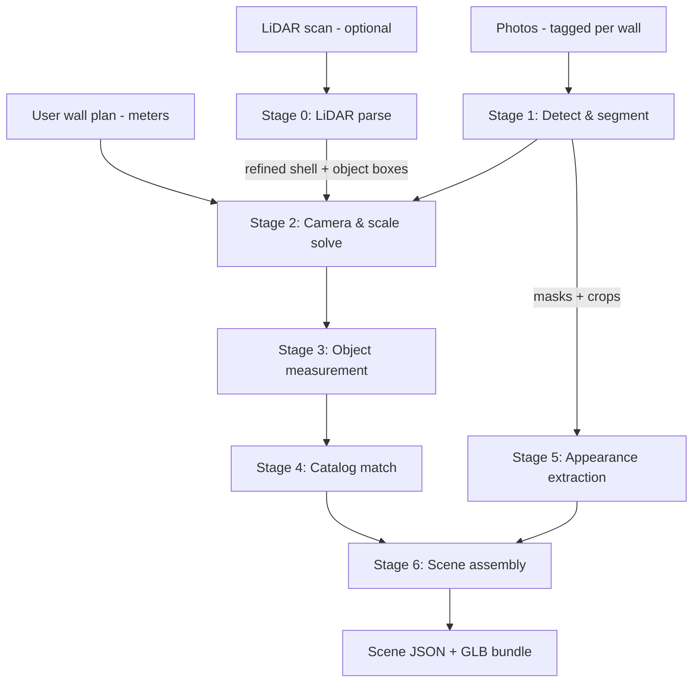

# 05 · Reconstruction Pipeline — Photos & LiDAR → Editable Objects

This is the app's headline capability: turning a wall plan + photos (+ optional LiDAR) into a scaled 3D scene of **discrete, editable objects**. The design follows the master principle ([`../BLUEPRINT.md`](../BLUEPRINT.md) §2): *recognize and rebuild, never fuse*.

All models named here are Apache-2.0/MIT/BSD licensed and commercially safe — verify against [`08-open-source-stack.md`](08-open-source-stack.md) before substituting anything.

---

## 1. Pipeline overview

Stages run as the queue jobs defined in [`03-architecture.md`](03-architecture.md) §4. Each stage's output is a JSON artifact in object storage — every stage is independently re-runnable and debuggable.

## 2. Stage 0 — LiDAR parse (when a scan exists)

Input formats, in order of value:

| Format | What we extract | How |
|---|---|---|
| **RoomPlan JSON (+USDZ)** | Walls, doors, windows, and detected-object *category + oriented bounding box* — already parametric and metric | Direct JSON parse; this is the gold input |
| `.ply` / `.glb` mesh or point cloud | Wall planes (RANSAC plane fitting), floor plane, object-level clusters above floor | Open3D: downsample → normals → plane segmentation → Euclidean clustering |
| `.e57` / `.las` / `.laz` | Same as above after conversion | `pye57` / `laspy` → Open3D |

Processing: register scan to the user's plan (floor-plane leveling, then 2D ICP of extracted wall lines against the drawn polygon). Output: **refined shell** (corrected wall lengths/angles — user's drawing corrected, not replaced; large disagreements > 0.4 m flag a review prompt rather than silently overriding) plus **seed object boxes** (position + size + category when RoomPlan provides it).

## 3. Stage 1 — Detect & segment (per photo, parallel)

- **Open-vocabulary detection:** Grounding DINO prompted with an interior-design vocabulary (~120 classes: sofa, sectional, armchair, coffee table, TV, console, rug, floor lamp, pendant, curtain, plant, framed art, mirror, shelf, bed, dresser, dining table, chair, …).
- **Segmentation:** SAM 2 refines each detection box into a pixel mask.
- Per-photo output: `{class, confidence, box, mask, wallTag}` list + mask crops saved for Stage 5.
- Duplicate suppression across photos happens later in assembly (§7) — this stage stays per-photo and parallel.

## 4. Stage 2 — Camera & scale solve (the accuracy heart)

The plan gives us ground truth the vision models lack: **exact wall lengths and ceiling height**. Each photo is tagged to a wall (capture flow, doc 01 §6), so:

1. **Room-layout estimation** on each photo: wall/floor/ceiling boundary detection (floor-wall seam + vertical wall edges + any visible corner).
2. **Pose solve:** with the tagged wall's known length and known ceiling height as metric constraints, solve the camera pose (PnP on layout correspondences; EXIF focal length as intrinsics prior, fallback to FOV estimation).
3. **Metric depth:** Depth Anything V2 (metric variant) per photo, then **rescaled** so the depth at the known wall plane matches the solved geometry — this correction step is what turns "roughly metric" monocular depth into plan-accurate depth.

If LiDAR exists, solved poses/depths are further reconciled against the refined shell (LiDAR wins conflicts).

## 5. Stage 3 — Object measurement

For each detected object: back-project its mask through the corrected depth map → 3D point set → oriented bounding box (floor-aligned; wall-plane-aligned for wall-mounted classes). Merge with LiDAR seed boxes when present (LiDAR box wins size; photo wins category/appearance). Output per object: `{class, position (m), rotation, size WxDxH (m), support: floor|wall|surface, confidence}`.

## 6. Stage 4 — Catalog match

Each measured object is matched to the CC0 catalog (~600 curated models at launch, category-organized, dimension-annotated — build spec in `packages/catalog`):

- Candidate set by class → ranked by **shape similarity** (CLIP-style image embedding of the photo crop vs. pre-rendered catalog thumbnails; OpenCLIP, MIT) and **dimension fit** (penalize > 15% deviation after allowed non-uniform scale).
- The winner is instantiated at measured position/size. Its two runners-up are stored in the scene document so the "wrong item?" swap sheet can offer them instantly.
- No acceptable match (score below threshold) → **parametric fallback**: a clean procedural stand-in (box/cylinder-composed shapes per category — e.g., generic sofa massing) at correct dimensions, clearly styled as a placeholder, with a one-tap "choose a better match" prompt. *Never omit a detected object silently.*

## 7. Stages 5–6 — Appearance & assembly

- **Appearance:** dominant-color palette (k-means in Lab space over the mask crop, lighting-normalized) applied to the matched model's designated albedo slots; flat-front classes (framed art, mirrors, TVs, rugs) get the actual rectified photo crop as their face texture. Result: the couch is *their* couch color; the gallery wall shows *their* prints.
- **Assembly:** fan-in stage that (a) dedupes objects seen in multiple photos (3D IoU + class match), (b) resolves collisions/support (objects sit on floor or mount flush to walls; small items may sit on detected surfaces), (c) snaps near-wall objects parallel to their wall, (d) writes the final `Scene` document ([`07-data-model.md`](07-data-model.md) §3) and compiles the asset bundle (referenced catalog GLBs + generated textures, Draco+KTX2 compressed).

## 8. Fallbacks — the pipeline never dead-ends

| Failure | Behavior |
|---|---|
| A photo unusable (blur/dark) | Skip it; per-wall coverage report → "Wall C could use a better photo" prompt |
| Pose solve fails on a photo | Objects from that photo placed against their tagged wall at depth-estimated distances, flagged `lowConfidence` (amber outline in sandbox) |
| No catalog match | Parametric placeholder (§6) |
| Detection finds nothing | Empty-but-accurate room shell + friendly nudge into manual furnishing (M3 catalog flow) |
| LiDAR parse fails | Proceed photo-only; toast explains the scan couldn't be read (with format guidance) |

Every fallback produces an editable scene. Worst case equals the M3 manual product, which is already useful.

## 9. Accuracy tiers & regression suite

| Tier (badge) | Inputs | Expected accuracy |
|---|---|---|
| **Sketch** | Plan only | Walls exact as drawn; no contents |
| **Photo-calibrated** | Plan + photos | Walls exact; object positions ± 15 cm, sizes ± 10% |
| **LiDAR-verified** | Plan + photos + scan | Shell ± 2 cm; object positions ± 5 cm, sizes ± 5% |

Published in-app (accuracy badge, doc 01 §7) — the honesty contract with the user.

**Golden-room regression suite (CI):** ≥ 5 fixture rooms (real measured rooms: photos + LiDAR + hand-labeled ground truth scenes). Every pipeline change runs the suite; regressions in position/size error, detection recall, or match quality block merge. This suite is the pipeline's unit test — build it in M4 *before* tuning models.

## 10. Non-goals (v1)

Multi-room scans · outdoor spaces · pets/people removal beyond mask-exclusion · pixel-exact object twins (see scope guards, [`../BLUEPRINT.md`](../BLUEPRINT.md) §8) · on-device reconstruction (revisit when WebGPU inference matures; the job API isolates the client from this decision).
