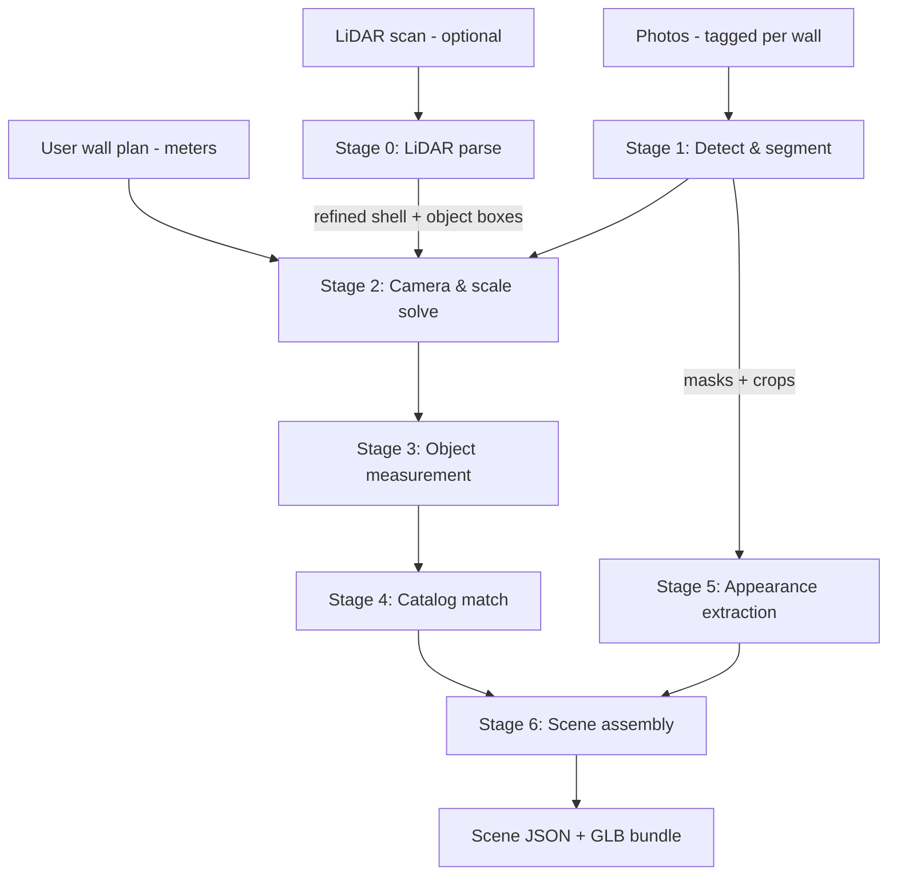

# 05 · Reconstruction Pipeline 2.0 — Photos & LiDAR → Editable Objects

This is the app's headline capability: turning a wall plan + photos (+ optional LiDAR) into a scaled 3D scene of **discrete, editable objects**. The design follows the master principle ([`../BLUEPRINT.md`](../BLUEPRINT.md) §2): *recognize and rebuild, never fuse*.

All models named here are Apache-2.0/MIT/BSD licensed and commercially safe — verify against [`08-open-source-stack.md`](08-open-source-stack.md) before substituting anything.

---

## 0. What changed in 2.0, and why

Version 1.0 of this document described the pipeline correctly and shipped it with one assumption buried in the implementation: that the model-backed stages run on a CUDA device. `workers/vision/detect.py` refused to start unless `torch.cuda.is_available()`, and §10 listed on-device reconstruction as a non-goal "until WebGPU inference matures".

Both of those have been corrected, for two independent reasons.

**The GPU requirement was never real.** PyTorch's default device is the CPU; CUDA is one optional backend among CUDA, Metal (MPS), Intel XPU, ROCm, and the CPU. The models this pipeline uses are small — Depth Anything V2 Small is 24.8 M parameters, SlimSAM is 27 M — and a reconstruction is a handful of photos, not a video stream. Measured on a four-core CPU container with no GPU present, Depth Anything V2 returns a correct depth map for a room photo in **12.4 seconds**. `docs/03` §8 already required this ("full local pipeline must run on a laptop without GPU"); the code simply did not honour it.

**WebGPU matured.** It ships enabled by default in Safari on iOS 26, backed by Metal. A recent iPhone has a six-core GPU and a sixteen-core Neural Engine. That is not a device that needs to send its photos to a server to have them looked at, and doing so anyway is a privacy cost with nothing bought for it.

So 2.0 replaces "the GPU tier" with **a tier chosen per device**, and the accuracy contract in §9 becomes a property of the inputs rather than of the hardware.

## 1. Pipeline overview

Stages run as the queue jobs defined in [`03-architecture.md`](03-architecture.md) §4. Each stage's output is a JSON artifact in object storage — every stage is independently re-runnable and debuggable.

## 1a. Where the stages run (new in 2.0)

Three tiers. The pipeline is identical on all of them; only latency differs.

| Tier | Hardware | Chosen when | Photos leave the device? |
|---|---|---|---|
| **Device** | Phone/laptop GPU via WebGPU → Metal/Vulkan/D3D12 | `navigator.gpu` yields an adapter that can allocate ≥ 128 MB | No |
| **Device (CPU)** | The same ONNX graphs through WebAssembly SIMD | No WebGPU, but the browser runs wasm | No |
| **Service** | The API's Python workers — CUDA, MPS, XPU, or CPU, in that preference order | The browser can do neither, or the user opts in for speed | Yes, then deleted |

Selection lives in `apps/web/src/lib/inference/device.ts` (client) and `workers/vision/device.py` (server). Neither ever refuses for want of a particular vendor. **There is no "unsupported device" outcome** — that property is pinned by `apps/web/e2e/inference-tier.spec.ts`.

The privacy surface (doc 01 §7) states which tier ran, because "where do my photos go" has a different true answer per device.

Model checkpoints per tier, all Apache-2.0 or MIT:

| Stage | Service tier | Device tier |
|---|---|---|
| 1 · detect | `IDEA-Research/grounding-dino-base` | `grounding-dino-tiny` |
| 1 · segment | `facebook/sam2-hiera-large` | `Zigeng/SlimSAM-uniform-77` |
| 2 · depth | `depth-anything/Depth-Anything-V2-Small-hf` | `onnx-community/depth-anything-v2-small` |
| 4 · ranking | OpenCLIP ViT-B/32 | `Xenova/clip-vit-base-patch32` |

The device tier uses distilled siblings of the same architectures, so a scene reconstructed on a phone and one reconstructed on the service agree on class and geometry; they differ in recall on small or occluded objects, which the accuracy badge reflects.

## 2. Stage 0 — LiDAR parse (when a scan exists)

Input formats, in order of value:

| Format | What we extract | How |
|---|---|---|
| **RoomPlan JSON (+USDZ)** | Walls, doors, windows, and detected-object *category + oriented bounding box* — already parametric and metric | Direct JSON parse; this is the gold input |
| `.ply` / `.glb` mesh or point cloud | Wall planes (RANSAC plane fitting), floor plane, object-level clusters above floor | Open3D: downsample → normals → plane segmentation → Euclidean clustering |
| `.e57` / `.las` / `.laz` | Same as above after conversion | `pye57` / `laspy` → Open3D |

Processing: register scan to the user's plan (floor-plane leveling, then 2D ICP of extracted wall lines against the drawn polygon). Output: **refined shell** (corrected wall lengths/angles — user's drawing corrected, not replaced; large disagreements > 0.4 m flag a review prompt rather than silently overriding) plus **seed object boxes** (position + size + category when RoomPlan provides it).

Stage 0 is pure point-cloud geometry and has never needed a GPU on any tier.

## 3. Stage 1 — Detect & segment (per photo, parallel)

- **Open-vocabulary detection:** Grounding DINO prompted with an interior-design vocabulary (~120 classes: sofa, sectional, armchair, coffee table, TV, console, rug, floor lamp, pendant, curtain, plant, framed art, mirror, shelf, bed, dresser, dining table, chair, …).
- **Segmentation:** SAM refines each detection box into a pixel mask.
- Per-photo output: `{class, confidence, box, mask, wallTag}` list + mask crops saved for Stage 5.
- Duplicate suppression across photos happens later in assembly (§7) — this stage stays per-photo and parallel.

The detection vocabulary is generated from the shared taxonomy in `packages/catalog`, so the classes the detector can name and the classes the app can place cannot drift apart.

## 4. Stage 2 — Camera & scale solve (the accuracy heart)

The plan gives us ground truth the vision models lack: **exact wall lengths and ceiling height**. Each photo is tagged to a wall (capture flow, doc 01 §6), so:

1. **Room-layout estimation** on each photo: wall/floor/ceiling boundary detection (floor-wall seam + vertical wall edges + any visible corner).
2. **Pose solve:** with the tagged wall's known length and known ceiling height as metric constraints, solve the camera pose (PnP on layout correspondences; EXIF focal length as intrinsics prior, fallback to FOV estimation).
3. **Metric depth:** Depth Anything V2 per photo, then **rescaled** so the depth at the known wall plane matches the solved geometry — this correction step is what turns "roughly metric" monocular depth into plan-accurate depth.

Step 3 is why the smallest depth checkpoint suffices on every tier: we need *shape* from the network and take *scale* from the user's plan. A network that is 20% off in absolute scale but internally consistent produces the same final geometry after rescaling as one that is perfectly calibrated.

If LiDAR exists, solved poses/depths are further reconciled against the refined shell (LiDAR wins conflicts).

## 5. Stage 3 — Object measurement

For each detected object: back-project its mask through the corrected depth map → 3D point set → oriented bounding box (floor-aligned; wall-plane-aligned for wall-mounted classes). Merge with LiDAR seed boxes when present (LiDAR box wins size; photo wins category/appearance). Output per object: `{class, position (m), rotation, size WxDxH (m), support: floor|wall|surface, confidence}`.

## 6. Stage 4 — Catalog match

Each measured object is matched to the CC0 catalog (~600 curated models at launch, category-organized, dimension-annotated — build spec in `packages/catalog`):

- Candidate set by class → ranked by **shape similarity** (CLIP-style image embedding of the photo crop vs. pre-rendered catalog thumbnails; OpenCLIP, MIT) and **dimension fit** (penalize > 15% deviation after allowed non-uniform scale).
- The winner is instantiated at measured position/size. Its two runners-up are stored in the scene document so the "wrong item?" swap sheet can offer them instantly.
- No acceptable match (score below threshold) → **parametric fallback**: a clean procedural stand-in (box/cylinder-composed shapes per category — e.g., generic sofa massing) at correct dimensions, clearly styled as a placeholder, with a one-tap "choose a better match" prompt. *Never omit a detected object silently.*

## 7. Stages 5–6 — Appearance & assembly

- **Appearance:** dominant-color palette (k-means in Lab space over the mask crop, lighting-normalized) applied to the matched model's designated albedo slots; flat-front classes (framed art, mirrors, TVs, rugs) get the actual rectified photo crop as their face texture. Result: the couch is *their* couch color; the gallery wall shows *their* prints.
- **Assembly:** fan-in stage that (a) dedupes objects seen in multiple photos (3D IoU + class match), (b) resolves collisions/support (objects sit on floor or mount flush to walls; small items may sit on detected surfaces), (c) snaps near-wall objects parallel to their wall, (d) writes the final `Scene` document ([`07-data-model.md`](07-data-model.md) §3) and compiles the asset bundle (referenced catalog GLBs + generated textures, Draco+KTX2 compressed).

Stages 4 and 6 are pure operations over the catalog manifest and room geometry and run in TypeScript on every tier (`packages/recon`).

## 8. Fallbacks — the pipeline never dead-ends

| Failure | Behavior |
|---|---|
| A photo unusable (blur/dark) | Skip it; per-wall coverage report → "Wall C could use a better photo" prompt |
| Pose solve fails on a photo | Objects from that photo placed against their tagged wall at depth-estimated distances, flagged `lowConfidence` (amber outline in sandbox) |
| No catalog match | Parametric placeholder (§6) |
| Detection finds nothing | Empty-but-accurate room shell + friendly nudge into manual furnishing (M3 catalog flow) |
| LiDAR parse fails | Proceed photo-only; toast explains the scan couldn't be read (with format guidance) |
| **No WebGPU on this device** | **Fall to the wasm tier. Slower, still local, still complete.** |
| **No local inference runtime at all** | **Fall to the service tier, and say so on the privacy surface.** |
| ML runtime missing on a service worker | Accurate empty room + the operator-facing reason. Never a dead end for the user. |

Every fallback produces an editable scene. Worst case equals the M3 manual product, which is already useful.

**Absence of a GPU is not in this table**, because it is not a failure. It selects a tier.

## 9. Accuracy tiers & regression suite

| Tier (badge) | Inputs | Expected accuracy |
|---|---|---|
| **Sketch** | Plan only | Walls exact as drawn; no contents |
| **Photo-calibrated** | Plan + photos | Walls exact; object positions ± 15 cm, sizes ± 10% |
| **LiDAR-verified** | Plan + photos + scan | Shell ± 2 cm; object positions ± 5 cm, sizes ± 5% |

Note that these are properties of the **inputs**, not of the hardware. A room reconstructed on a phone and the same room reconstructed on a CUDA server carry the same badge, because the plan supplies the scale in both cases (§4). What the device tier costs is *recall* — small and heavily occluded objects the distilled detector misses — not metric accuracy on the objects it does find.

Published in-app (accuracy badge, doc 01 §7) — the honesty contract with the user.

**Golden-room regression suite (CI):** ≥ 5 fixture rooms (real measured rooms: photos + LiDAR + hand-labeled ground truth scenes). Every pipeline change runs the suite; regressions in position/size error, detection recall, or match quality block merge. This suite is the pipeline's unit test.

> **Status:** the fixtures do not exist yet — they are tape-measure measurements of real rooms and cannot be generated. Until they do, `pnpm test:golden` reports that it certified nothing rather than passing quietly, and **every number in the table above is a target, not a measurement**. See `fixtures/golden-rooms/README.md`.

## 10. Non-goals (v1)

Multi-room scans · outdoor spaces · pets/people removal beyond mask-exclusion · pixel-exact object twins (see scope guards, [`../BLUEPRINT.md`](../BLUEPRINT.md) §8).

*Removed in 2.0:* on-device reconstruction. It was deferred pending WebGPU maturity; WebGPU is here, and §1a is the result.

## 11. What this pipeline is not for

Reconstruction is a **discriminative** problem: which object is that, how big is it, where is it. Generative image models cannot answer any of those questions, and nothing in stages 0–6 uses one.

There is a generative surface in this app — restyle renders for compare and share ([`06-sandbox-and-editing.md`](06-sandbox-and-editing.md) §6), implemented in `workers/diffusion`. It runs *after* reconstruction, over a render of the finished scene, and it is constrained by the scene's own depth buffer so it cannot move the furniture. It is licence-gated and off by default: its base model is CreativeML-OpenRAIL-M, which docs/08 §7 does not permit bundling.

Keeping that boundary sharp is deliberate. A scene assembled from generated pixels would not be editable, would not be measured, and would break the master principle this document opens with.
