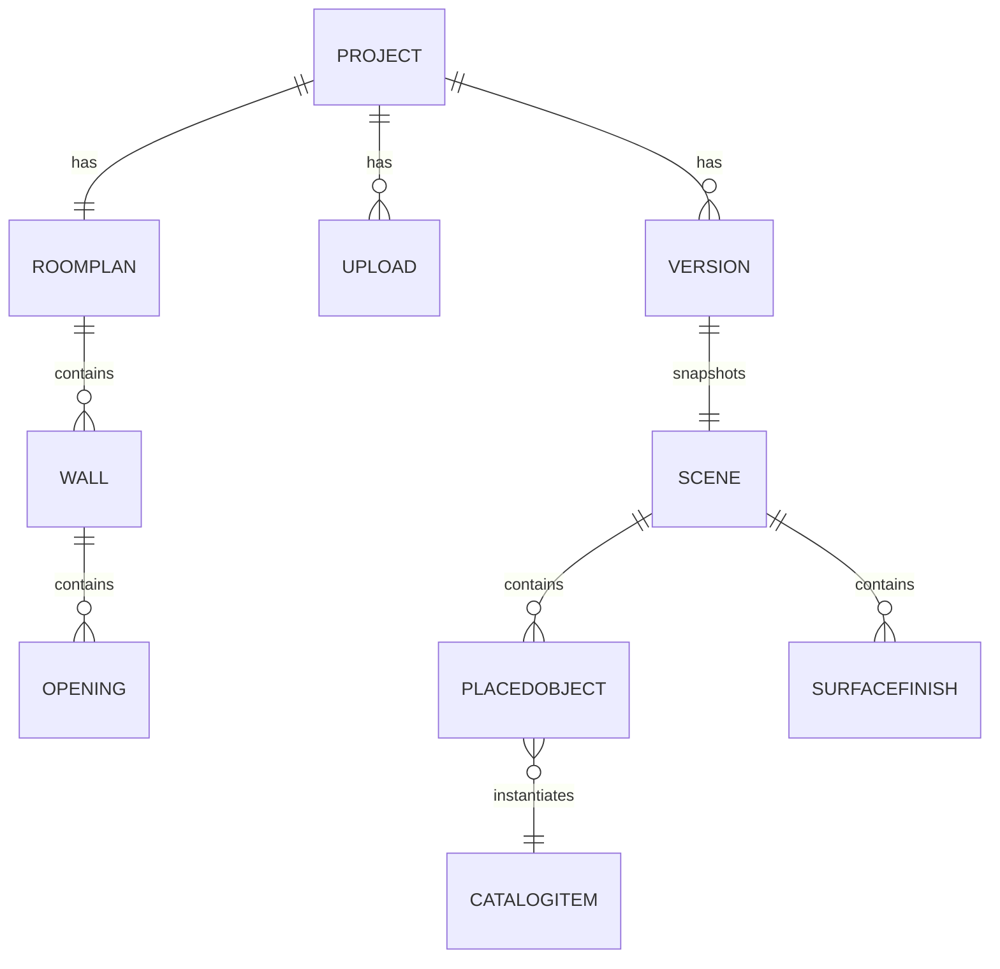

# 07 · Data Model & File Formats

Single source of truth: `packages/schema` (zod schemas → generated JSON Schema for the Python workers, generated TS types for client/API). The shapes below are normative; field-level refinements happen in code review against these invariants.

**Global conventions:** all lengths in **meters** (floats), all angles in **radians**, coordinate system right-handed **Y-up** (X east, Z south; the 2D plan's (x, y) maps to 3D (x, −z)). IDs are UUIDv7. Every document carries `schemaVersion` for migrations.

---

## 1. Entity overview



## 2. RoomPlan (output of the drawing board)

```jsonc
{
  "schemaVersion": 1,
  "id": "…",
  "units": "m",                        // storage always m; display pref lives on the user
  "vertices": [ { "id": "…", "x": 0.0, "y": 0.0 }, … ],
  "walls": [
    {
      "id": "…",
      "label": "A",                    // A, B, C… clockwise from northernmost (doc 04 §5)
      "start": "<vertexId>", "end": "<vertexId>",
      "thickness": 0.115,
      "height": 2.44,                  // inherits project default unless overridden
      "openings": [
        {
          "id": "…", "kind": "door" | "window",
          "offset": 1.2,               // m from wall start, to opening start
          "width": 0.82,
          "sillHeight": 0.0,           // 0 for doors
          "headHeight": 2.03,
          "swing": "left" | "right" | null
        }
      ]
    }
  ],
  "closed": true,
  "floorArea": 29.76,                  // derived, cached
  "source": "drawn" | "drawn+lidarRefined",
  "curvedWalls": null, "roomGroups": null   // reserved (v1 non-goals, doc 04 §1)
}
```

**Invariants:** walls form one closed simple polygon when `closed`; `offset + width ≤ wall length`; openings on one wall don't overlap; `thickness ∈ [0.05, 0.5]`, `height ∈ [2.0, 6.0]`.

## 3. Scene (what the sandbox renders — the editable document)

```jsonc
{
  "schemaVersion": 1,
  "id": "…",
  "planId": "…",                       // the RoomPlan this scene sits inside
  "objects": [ /* PlacedObject, §4 */ ],
  "finishes": {
    "walls": { "<wallId>": { "color": "#9CAF88", "finish": "matte" }, "default": { … } },
    "floor": { "materialId": "wood/oak-natural-01" },
    "ceiling": { "color": "#F4F2EC" },
    "baseboard": { "color": "#FFFFFF", "height": 0.09 }
  },
  "lighting": { "hdri": "studio-warm-01", "keyIntensity": 1.0 },
  "provenance": {
    "tier": "sketch" | "photo" | "lidar",       // accuracy badge (doc 05 §9)
    "reconstructionJobId": "…" | null,
    "generatedAt": "ISO-8601"
  }
}
```

## 4. PlacedObject (one editable thing in the room)

```jsonc
{
  "id": "…",
  "catalogId": "sofa/modern-3seat-04" | null,   // null ⇒ parametric placeholder
  "placeholder": { "category": "sofa", "shape": "sofaMassing" } | null,
  "label": "Sofa",
  "support": "floor" | "wall" | "surface",
  "wallId": "…" | null,                 // required when support = "wall"
  "parentObjectId": "…" | null,         // required when support = "surface"
  "position": { "x": 1.2, "y": 0.0, "z": -3.4 },   // Y-up world, m
  "rotationY": 1.5708,                  // wall-mounted: derived from wall normal
  "size": { "w": 2.20, "d": 0.95, "h": 0.85 },      // actual instance size, m
  "materials": {                        // per-slot overrides of the catalog defaults
    "upholstery": { "color": "#5B6247" },
    "legs": { "color": "#2B2B2B" },
    "face": { "textureRef": "uploads/…/crop-17.ktx2" }   // art/TV/mirror photo faces
  },
  "collisionExempt": false,             // true for rugs, wall items (doc 06 §3)
  "recon": {                            // present only on pipeline-created objects
    "confidence": 0.91,
    "sourcePhotoIds": ["…"],
    "runnerUpCatalogIds": ["sofa/modern-3seat-02", "sofa/lowback-01"],
    "lowConfidence": false
  }
}
```

**Invariants:** exactly one of `catalogId`/`placeholder` is non-null; `support` prerequisites hold (`wallId`/`parentObjectId`); wall objects' positions lie on their wall plane within ε = 1 cm; sizes within the catalog item's declared scale bounds.

## 5. CatalogItem (curated CC0 library manifest entry)

```jsonc
{
  "id": "sofa/modern-3seat-04",
  "category": "sofa",
  "name": "Modern 3-Seat Sofa",
  "asset": { "glb": "catalog/…/model.glb", "tris": 9800 },   // ≤ 15k enforced
  "nativeSize": { "w": 2.10, "d": 0.92, "h": 0.83 },
  "scaleBounds": { "min": 0.8, "max": 1.25, "nonUniform": true },
  "materialSlots": ["upholstery", "legs"],
  "faceSlot": null,                      // "face" for frames/TVs/mirrors/rugs
  "support": "floor",
  "embedding": "catalog/…/clip.bin",     // for pipeline matching (doc 05 §6)
  "license": "CC0", "source": "https://…", "attribution": "optional courtesy note"
}
```

## 6. Project, Version, Upload (API-level records, PostgreSQL)

- **Project:** `{ id, ownerId, name, createdAt, updatedAt, planId, currentSceneId, accuracyTier, thumbnailRef }`
- **Version:** `{ id, projectId, name, sceneSnapshotRef, thumbnailRef, createdAt, locked }` — `locked=true` only for version zero "Original room".
- **Upload:** `{ id, projectId, kind: "photo"|"lidar", filename, byteSize, sha256, wallTag?, exif?, status: "pending"|"stored"|"rejected", storageRef }`

## 7. Accepted upload formats (validation table)

| Kind | Extensions | Magic-byte check | Limits |
|---|---|---|---|
| Photo | `.jpg` `.jpeg` `.png` `.heic` `.webp` | required | ≤ 25 MB each, ≤ 40/project; HEIC transcoded server-side |
| LiDAR — RoomPlan | `.usdz` (+ `.json` sidecar) | zip/usdz magic | ≤ 500 MB |
| LiDAR — mesh/cloud | `.ply` `.glb` `.e57` `.las` `.laz` | required per format | ≤ 500 MB |

Rejected files get a `problem+json` reason the UI turns into plain-language guidance (doc 01 §7).

## 8. Storage layout & versioning discipline

- IndexedDB (client, write-primary): `projects/{id}` → full ProjectDocument (plan + scene + versions + undo stack). Sync per [`03-architecture.md`](03-architecture.md) §6.
- Object storage keys: `uploads/{userId}/{projectId}/{uploadId}.{ext}` · `scenes/{projectId}/{sceneId}/bundle.glb` + `scene.json` · `catalog/{hash}/…` (immutable).
- **Migrations:** every `schemaVersion` bump ships a forward migration in `packages/schema/migrations`; the client migrates local documents on load; the API migrates on read, writes back current. No document is ever unreadable by a newer app.
